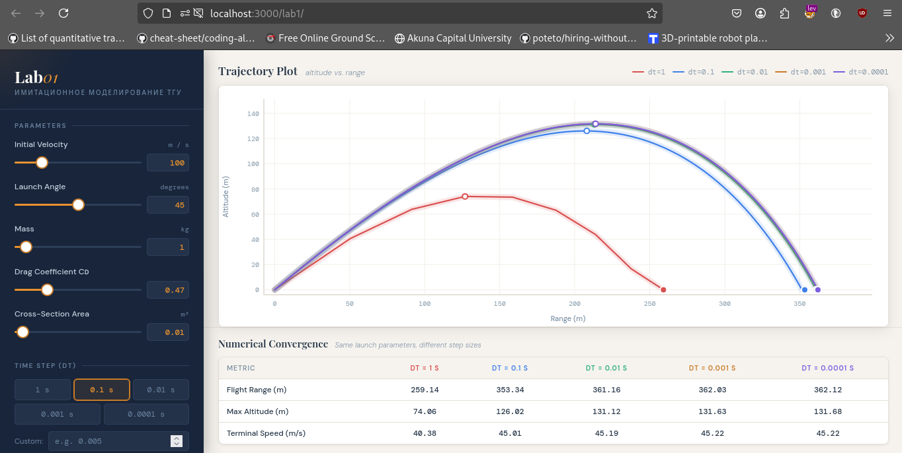

### Моделирование полёта тела в атмосфере

**Задание:**
Реализовать приложение для моделирования полёта тела в атмосфере.
Предусмотреть возможность ввода шага моделирования и вывода результатов.

Выполнить моделирование **без очистки предыдущих результатов** для различных шагов моделирования, сравнить траектории и заполнить таблицу:

| Шаг моделирования, с           | 1   | 0.1 | 0.01 | 0.001 | 0.0001 |
| ------------------------------ | --- | --- | ---- | ----- | ------ |
| Дальность полёта, м            |     |     |      |       |        |
| Максимальная высота, м         |     |     |      |       |        |
| Скорость в конечной точке, м/с |     |     |      |       |        |

**Сделать выводы.**

**В отчёт включить:**

- код программы;
- скриншот с несколькими траекториями;
- заполненную таблицу;
- выводы.

---

## ОТЧЕТ

### код

```go
func simulate(req SimRequest) SimResult {
	dt := req.Step
	angle := req.AngleDeg * math.Pi / 180.0

	vx := req.V0 * math.Cos(angle)
	vy := req.V0 * math.Sin(angle)
	x := 0.0
	y := 0.0
	t := 0.0
	maxY := 0.0

	var points []Point
	storeEvery := 1
	if dt < 0.001 {
		storeEvery = 10
	} else if dt < 0.01 {
		storeEvery = 5
	}

	stepCount := 0
	maxSteps := 10_000_000

	for stepCount < maxSteps {
		v := math.Sqrt(vx*vx + vy*vy)
		rho := airDensity(y)
		drag := 0.5 * req.Cd * rho * req.Area * v * v
		ax := -drag * vx / (v * req.Mass)
		ay := -g - drag * vy / (v * req.Mass)

		if stepCount % storeEvery == 0 {
			points = append(points, Point{T: t, X: x, Y: y, Vx: vx, Vy: vy, V: v})
		}

		vx += ax * dt
		vy += ay * dt
		x += vx * dt
		y += vy * dt
		t += dt
		stepCount++

		if y > maxY {
			maxY = y
		}
		if y <= 0 && t > dt*2 {
			break
		}
	}

	points = append(points, Point{T: t, X: x, Y: 0, Vx: vx, Vy: vy, V: math.Sqrt(vx*vx + vy*vy)})

	return SimResult{
		Points:        points,
		FlightRange:   x,
		MaxAltitude:   maxY,
		TerminalSpeed: math.Sqrt(vx*vx + vy*vy),
		FlightTime:    t,
		Step:          req.Step,
		Color:         req.Color,
	}
}
```

### таблицу

| Шаг моделирования, с           | 1      | 0.1    | 0.01   | 0.001  | 0.0001 |
| ------------------------------ | ------ | ------ | ------ | ------ | ------ |
| Дальность полёта, м            | 259.14 | 353.34 | 361.16 | 362.03 | 362.12 |
| Максимальная высота, м         | 74.06  | 126.02 | 131.12 | 131.63 | 131.68 |
| Скорость в конечной точке, м/с | 40.38  | 45.01  | 45.19  | 45.22  | 45.22  |

---

### скриншот:



### Вывод:

Было проведено моделирование полета тела с различными значениями шага по времени `Δt`. На основании различных запусков были сделаны следующие выводы:

**Сходимость результатов:** При уменьшении шага до 0,01 с и ниже значения стабилизируются. Разница между шагами 0,001 и 0,0001 практически отсутствует.

**Оптимальный параметр:** Для данной модели оптимальным является шаг 0.01–0.001 с.
