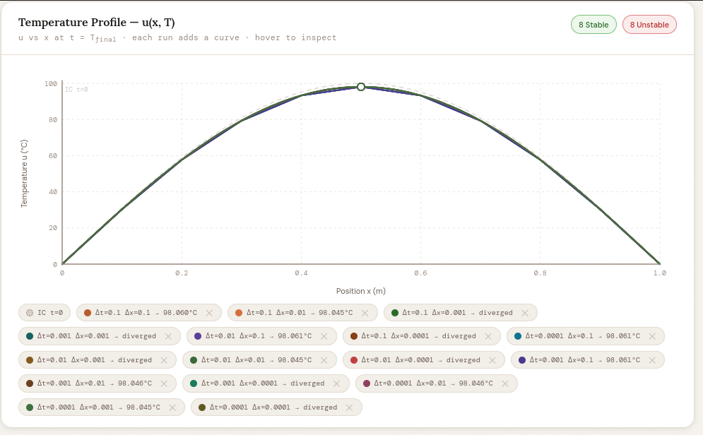
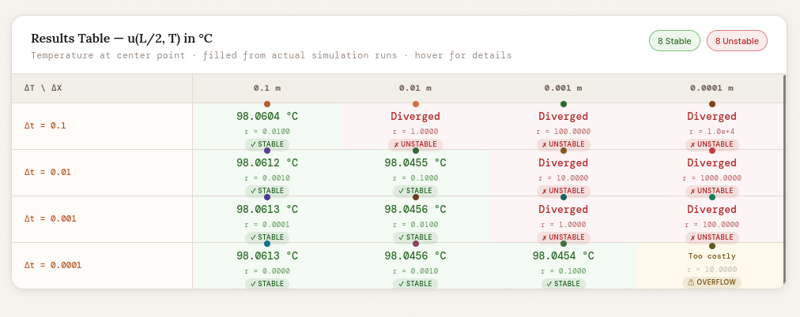

### Метод конечных разностей для уравнения теплопроводности

**Задание:**
Реализовать моделирование изменения температуры в пластине на основе одномерного уравнения теплопроводности с использованием метода конечных разностей.

Выполнить моделирование с различными шагами по времени и по пространству.
Заполнить таблицу значений температуры в центральной точке пластины после 2 секунд модельного времени.

| Шаг по времени, с \ Шаг по пространству, м | 0.1 | 0.01 | 0.001 | 0.0001 |
| ------------------------------------------ | --- | ---- | ----- | ------ |
| 0.1                                        |     |      |       |        |
| 0.01                                       |     |      |       |        |
| 0.001                                      |     |      |       |        |
| 0.0001                                     |     |      |       |        |

**Сделать вывод.**

---

## ОТЧЕТ

### код

```go
func simulate(p SimParams) SimResult {
	nx := int(math.Round(p.L/p.Dx)) + 1
	if nx < 3 {
		nx = 3
	}
	steps := int(math.Round(p.TFinal / p.Dt))
	if steps < 1 {
		steps = 1
	}
	r := p.Alpha * p.Dt / (p.Dx * p.Dx)
	stable := r <= 0.5

	ops := int64(nx) * int64(steps)
	if ops > MaxOps {
		return SimResult{
			Temperature: nil,
			Stable:      stable,
			CFL:         r,
			NX:          nx,
			Steps:       steps,
			Alpha:       p.Alpha,
			L:           p.L,
			TFinal:      p.TFinal,
			ICPeak:      p.ICPeak,
			Dt:          p.Dt,
			Dx:          p.Dx,
			Message:     fmt.Sprintf("Too costly: %d ops exceeds limit %d. Refine Δt or Δx.", ops, MaxOps),
		}
	}

	// u[i] at x = i*dx
	u := make([]float64, nx)
	for i := 0; i < nx; i++ {
		x := float64(i) * p.Dx
		u[i] = p.ICPeak * math.Sin(math.Pi*x/p.L)
	}
	u[0] = 0.0
	u[nx-1] = 0.0

	uNew := make([]float64, nx)

	diverged := false
	divergeStep := 0

	for t := 0; t < steps; t++ {
		uNew[0] = 0.0
		uNew[nx-1] = 0.0
		for i := 1; i < nx-1; i++ {
			uNew[i] = u[i] + r*(u[i+1]-2.0*u[i]+u[i-1])
		}
		u, uNew = uNew, u

		// check divergence at center
		mid := u[nx/2]
		if math.IsNaN(mid) || math.IsInf(mid, 0) || math.Abs(mid) > 1e15 {
			diverged = true
			divergeStep = t
			break
		}
	}

	if diverged {
		return SimResult{
			Temperature: nil,
			Stable:      false,
			CFL:         r,
			NX:          nx,
			Steps:       steps,
			Alpha:       p.Alpha,
			L:           p.L,
			TFinal:      p.TFinal,
			ICPeak:      p.ICPeak,
			Dt:          p.Dt,
			Dx:          p.Dx,
			Message:     fmt.Sprintf("Diverged at step %d (r=%.4f > 0.5)", divergeStep, r),
		}
	}

	// build sampled profile (at most 300 points for the graph)
	sampleCount := nx
	if sampleCount > 300 {
		sampleCount = 300
	}
	xVals := make([]float64, sampleCount)
	uVals := make([]float64, sampleCount)
	for i := 0; i < sampleCount; i++ {
		// map sample index to grid index
		gi := int(math.Round(float64(i) * float64(nx-1) / float64(sampleCount-1)))
		if gi >= nx {
			gi = nx - 1
		}
		xVals[i] = float64(gi) * p.Dx
		uVals[i] = u[gi]
	}

	centerIdx := nx / 2
	temp := u[centerIdx]
	msg := "Stable"
	if !stable {
		msg = fmt.Sprintf("Unstable (r=%.4f > 0.5)", r)
	}

	return SimResult{
		Temperature: &temp,
		Profile:     uVals,
		XValues:     xVals,
		Stable:      stable,
		CFL:         r,
		NX:          nx,
		Steps:       steps,
		Alpha:       p.Alpha,
		L:           p.L,
		TFinal:      p.TFinal,
		ICPeak:      p.ICPeak,
		Dt:          p.Dt,
		Dx:          p.Dx,
		Message:     msg,
	}
}
```

### таблицу

| Шаг по времени, с \ Шаг по пространству, м | 0.1     | 0.01     | 0.001    | 0.0001              |
| ------------------------------------------ | ------- | -------- | -------- | ------------------- |
| 0.1                                        | 98.0604 | Diverged | Diverged | Diverged            |
| 0.01                                       | 98.0612 | 98.0455  | Diverged | Diver d             |
| 0.001                                      | 98.0613 | 98.0456  | Diverged | Diverged            |
| 0.0001                                     | 98.0613 | 98.0456  | 98.0454  | Too costly/Overflow |

---

### скриншот:




### Вывод:

Результаты моделирования показывают, что явный метод конечных разностей является лишь условно устойчивым.

- **Условие КФЛ:** устойчивость строго зависит от отношения Δt/(Δx)². При уменьшении пространственного шага (Δx) временной шаг (Δt) необходимо уменьшать еще более резко, чтобы предотвратить расходимость решения.
- **Точность против стоимости:** Хотя теоретически меньшие шаги повышают точность, результаты показывают, что использование мелкозернистых пространственных сеток (Δx≤0,001) быстро становится вычислительно «слишком затратным» или нестабильным при применении явной схемы.

Для моделирования с высоким разрешением неявный метод будет более эффективным, поскольку он остается стабильным независимо от размера шага по времени.
