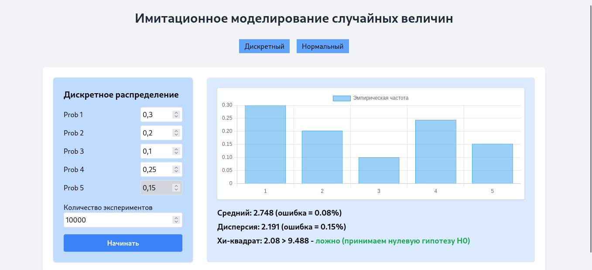
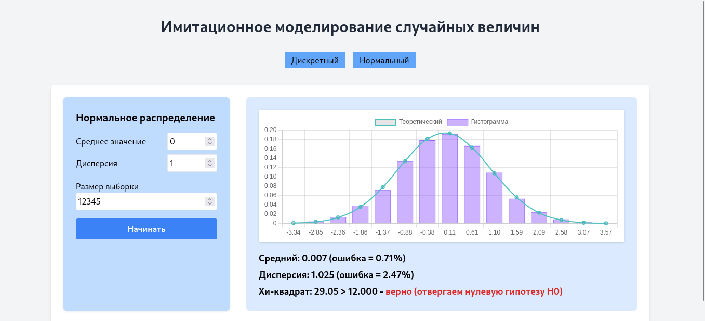
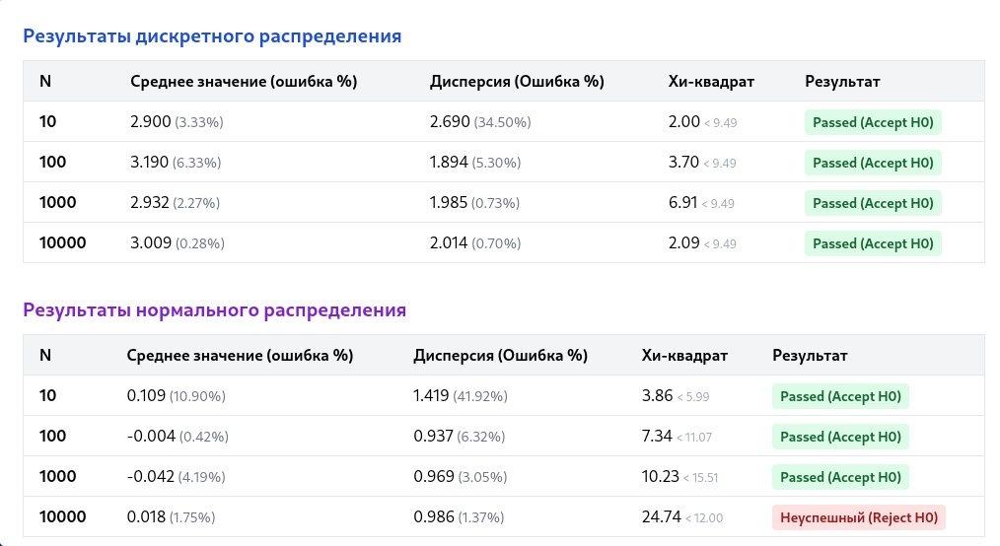

### Имитационное моделирование дискретных случайных величин (GUI)

#### lab06-1

**Задание:**

- Реализовать алгоритм проведения серии экспериментов по генерации дискретной случайной величины, заданной рядом распределения
- Вычислить эмпирические вероятности, выборочные среднее и дисперсию, их относительные погрешности
- Вычислить статистику хи-квадрат и применить критерий хи-квадрат при разных объемах выборки N (N = 10, 100, 1 000, 10 000)
- Сделать вывод

# 

---

#### lab06-2

**Задание:**

- Выполнить моделирование нормальной случайной величины любым методом. Провести статистическую обработку результатов:
  - построить гистограмму;
  - оценить точность (относительные погрешности, критерий хи-квадрат) для объемов выборки 10, 100, 1000, 10000;
  - сделать вывод.

---

---

### Вывод

В лабораторной работе был продемонстрирован закон больших чисел. Как метод кумулятивной вероятности для дискретных переменных, так и преобразование Бокса-Мюллера для нормально распределенных переменных являются надежными алгоритмами. Точность строго коррелирует с размером выборки N, при этом N≥1000 обеспечивает статистически значимую уверенность в том, что сгенерированные переменные соответствуют заданным профилям плотности вероятности.
