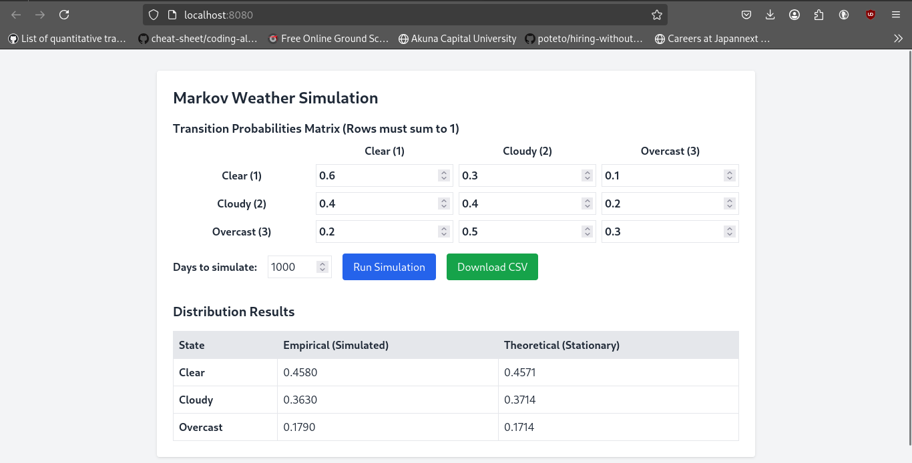

### Марковская модель погоды

**Задание:**
Смоделировать погоду по дням:

- 1 — ясно
- 2 — облачно
- 3 — пасмурно

Единица времени — **1 день**.
Задать интенсивности переходов между состояниями.

**Требования:**

1. Выполнить моделирование в «реальном» времени с визуализацией.
2. Провести статистическую обработку результатов.
3. Сравнить эмпирическое распределение с теоретическим стационарным.

Была реализована имитационная модель цепи Маркова с дискретным временем

Стационарные вероятности вычисляются через решение уравнения
$$\pi P=\pi \iff \pi (P - I) = 0$$

Что является определением левого собственного вектора

