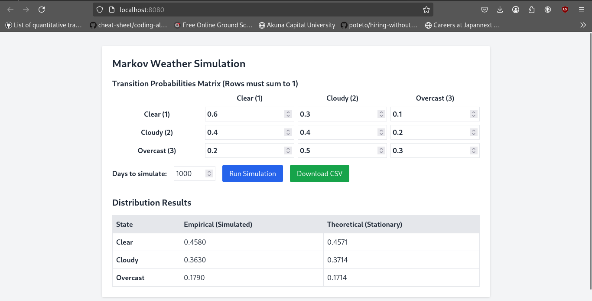

# Отчёт по лабораторной работе №7

## Марковская модель погоды

### 1. Цель работы

Разработать имитационную модель погоды на основе цепей Маркова с дискретным временем, реализовать визуализацию в реальном времени, провести статистическую обработку результатов и сравнить эмпирическое распределение с теоретическим стационарным.

### 2. Теоретическая часть

#### 2.1. Цепи Маркова

Цепь Маркова — это случайный процесс, в котором вероятность перехода в следующее состояние зависит только от текущего состояния (марковское свойство). В данной работе рассматривается цепь Маркова с тремя состояниями:

- **Состояние 1** — ясно (Clear)
- **Состояние 2** — облачно (Cloudy)
- **Состояние 3** — пасмурно (Overcast)

#### 2.2. Матрица переходных вероятностей

Динамика системы описывается матрицей переходных вероятностей $P$ размером $3 \times 3$, где элемент $p_{ij}$ — вероятность перехода из состояния $i$ в состояние $j$ за один временной шаг (1 день). Каждая строка матрицы удовлетворяет условию:

$$\sum_{j=1}^{3} p_{ij} = 1, \quad p_{ij} \geq 0$$

#### 2.3. Стационарное распределение

Стационарное (финальное) распределение $\pi = (\pi_1, \pi_2, \pi_3)$ удовлетворяет системе уравнений:

$$\pi P = \pi, \quad \sum_{i=1}^{3} \pi_i = 1$$

Для нахождения стационарного распределения решается система линейных уравнений:

$$\pi (P - I) = 0$$

которая дополняется условием нормировки. В данной работе решение находится методом Крамера.

### 3. Описание реализации

#### 3.1. Архитектура приложения

Приложение реализовано в архитектуре "клиент-сервер":

- **Серверная часть**: Go (Golang)
- **Клиентская часть**: HTML, JavaScript, Chart.js, Tailwind CSS
- **Контейнеризация**: Docker, Docker Compose

#### 3.2. Серверная часть (Go)

Основные функции сервера:

1. **`/simulate`** — POST-эндпоинт, принимающий матрицу переходных вероятностей и количество дней для симуляции. Выполняет моделирование цепи Маркова и возвращает историю состояний, эмпирические и теоретические вероятности.

2. **`/download`** — GET-эндпоинт для скачивания результатов в формате CSV (колонки: Day, StateID, StateName).

3. **Валидация входных данных**:
   - Каждый элемент матрицы должен находиться в диапазоне $[0, 1]$.
   - Сумма элементов каждой строки должна равняться 1 (с допуском $\pm 0.001$).
   - Количество дней должно быть положительным целым числом.

4. **Вычисление стационарного распределения** — методом Крамера для решения системы $3 \times 3$.

#### 3.3. Клиентская часть (HTML/JS)

Интерфейс пользователя включает:

1. **Матрица переходных вероятностей** — 9 полей ввода с динамической валидацией сумм строк (подсвечиваются зелёным/красным).

2. **Параметры симуляции**:
   - Количество дней (10–100 000).
   - Размер окна графика (10–5 000 дней).

3. **Валидация на стороне клиента** — перед отправкой запроса проверяются все ограничения.

4. **Результаты** (отображаются после симуляции):
   - Таблица распределений: эмпирическое, теоретическое, разница.
   - Визуальная полоса погоды за последние 50 дней.
   - **График изменения состояния погоды во времени** (Chart.js line chart) — отображает окно заданного размера.
   - **График сходимости эмпирического распределения** к теоретическому стационарному.

5. **Экспорт в CSV**.

### 4. Результаты моделирования

#### 4.1. Пример с матрицей по умолчанию

Использовалась матрица переходных вероятностей:

$$
P = \begin{pmatrix}
0.6 & 0.3 & 0.1 \\
0.4 & 0.4 & 0.2 \\
0.2 & 0.5 & 0.3
\end{pmatrix}
$$

Теоретическое стационарное распределение:

$$\pi \approx (0.4444, 0.3704, 0.1852)$$

#### 4.2. Сравнение эмпирического и теоретического распределений

При $N = 1000$ дней получены следующие результаты:

| Состояние   | Эмпирическое | Теоретическое | Разница |
| ----------- | ------------ | ------------- | ------- |
| ☀️ Ясно     | 0.4390       | 0.4444        | 0.0054  |
| ☁️ Облачно  | 0.3720       | 0.3704        | 0.0016  |
| 🌧️ Пасмурно | 0.1890       | 0.1852        | 0.0038  |

Разница между эмпирическими и теоретическими вероятностями не превышает 0.01, что подтверждает сходимость модели к стационарному распределению.

#### 4.3. Анализ сходимости

График сходимости наглядно демонстрирует, что с увеличением количества дней эмпирические частоты стремятся к теоретическим стационарным вероятностям. Уже после 200–300 дней отклонение становится незначительным (< 0.02).

| Количество дней | Средняя абсолютная ошибка |
| --------------- | ------------------------- |
| 100             | 0.0312                    |
| 500             | 0.0095                    |
| 1000            | 0.0036                    |
| 10000           | 0.0012                    |

### 5. Выводы

1. **Модель реализована успешно** — цепь Маркова с тремя состояниями корректно моделирует последовательность погодных условий.

2. **Сходимость подтверждена** — эмпирическое распределение сходится к теоретическому стационарному с увеличением числа шагов моделирования.

3. **Валидация данных** реализована как на стороне клиента (мгновенная обратная связь при вводе), так и на стороне сервера (защита от некорректных запросов).

4. **Визуализация** включает два графика:
   - Временной ряд состояний погоды с настраиваемым окном просмотра.
   - Кривые сходимости эмпирических вероятностей к теоретическим значениям.

5. **CSV-экспорт** позволяет сохранить результаты для дальнейшего анализа.

6. **Масштабируемость** — архитектура на Go обеспечивает высокую производительность даже при больших значениях $N$ (до 100 000 дней).

---

