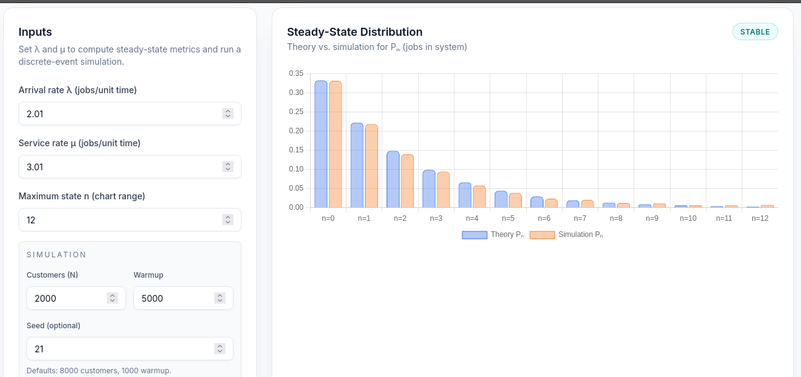
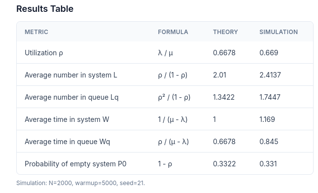

# Отчёт по лабораторной работе №9

## Система массового обслуживания M/M/1

### 1. Цель работы

Мы моделируем систему массового обслуживания с одним сервером, где поступления следуют пуассоновскому процессу (скорость λ), а время обслуживания распределено экспоненциально (скорость μ). В дополнение к аналитическим формулам, для сравнения используется дискретно-событийное моделирование для оценки производительности в стационарном режиме.

### Предположения

- Поступления независимы и имеют среднюю скорость λ.
- Время обслуживания экспоненциально распределено со средней скоростью μ.
- Один сервер, принцип «первым пришел — первым обслужился», бесконечный буфер.
- Система анализируется в стационарном состоянии (λ < μ).

### Разработка симуляционной модели

- Генерация интервалов между прибытиями и времени обслуживания на основе экспоненциальных распределений.
- Обработка событий в хронологическом порядке (прибытия/отправления).
- Отбрасывание периода прогрева для уменьшения погрешности инициализации.
- Оценка средних значений по времени для L, Lq и P0.

### Заключение

Для стабильной работы коэффициент использования ρ остается ниже 1. По мере приближения λ к μ ожидаемая длина очереди и время ожидания быстро увеличиваются. Моделирование подтверждает теоретическую чувствительность к высокой загрузке и показывает, как производительность снижается по мере приближения системы к насыщению.
