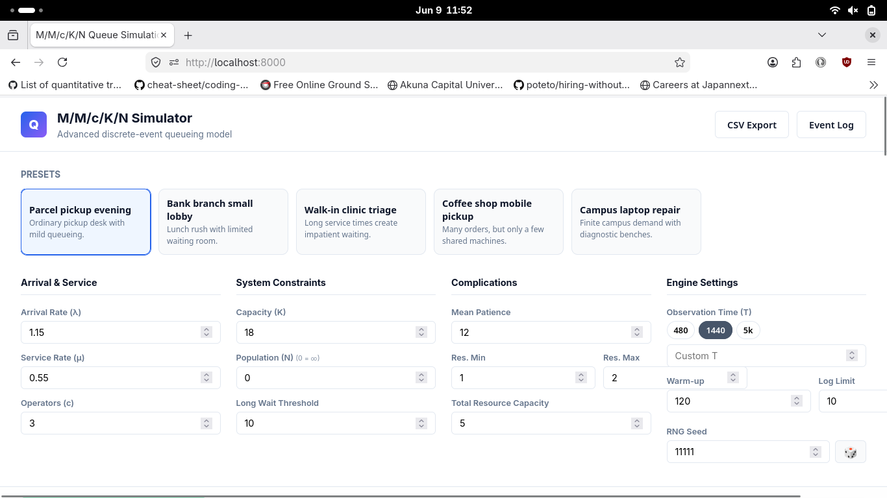
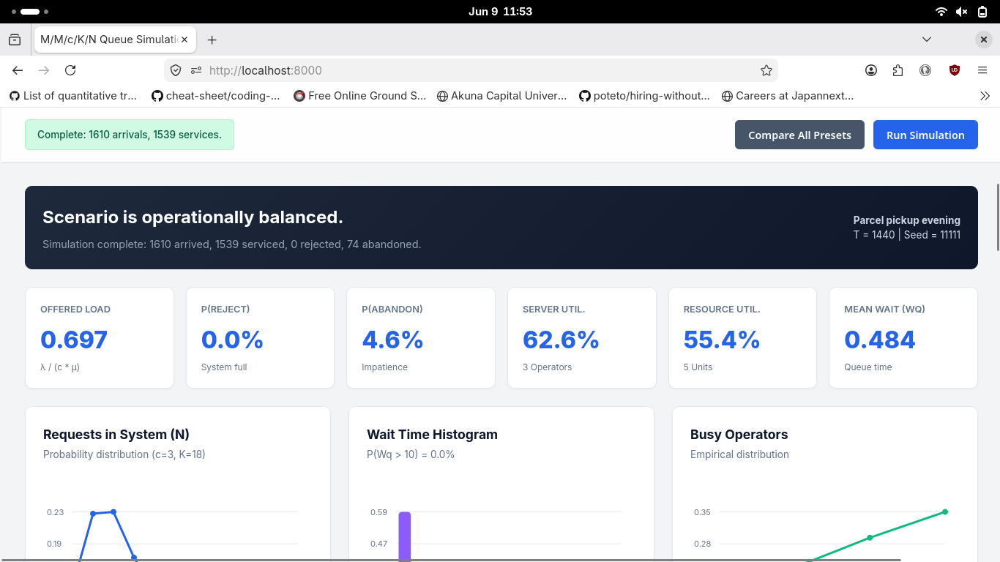
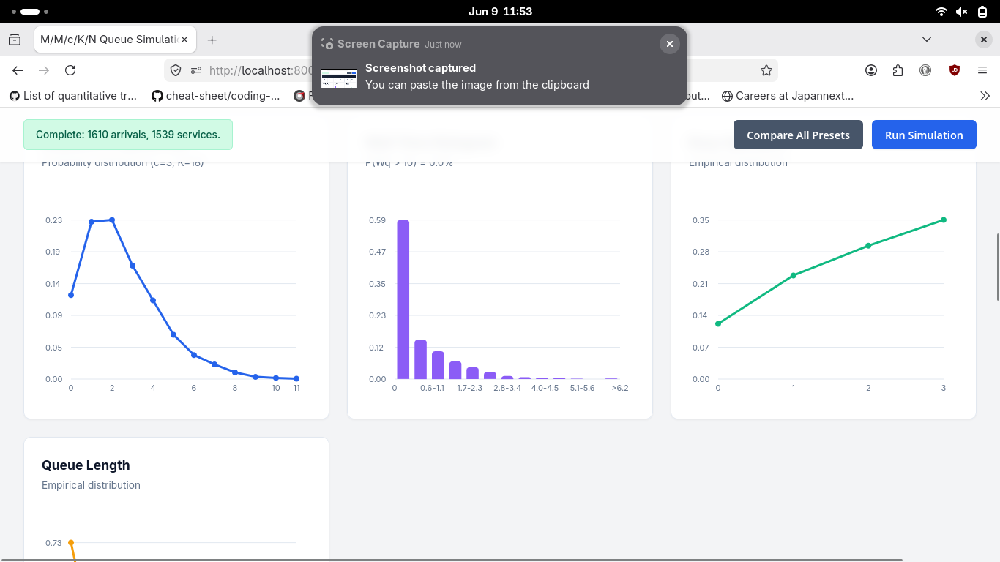
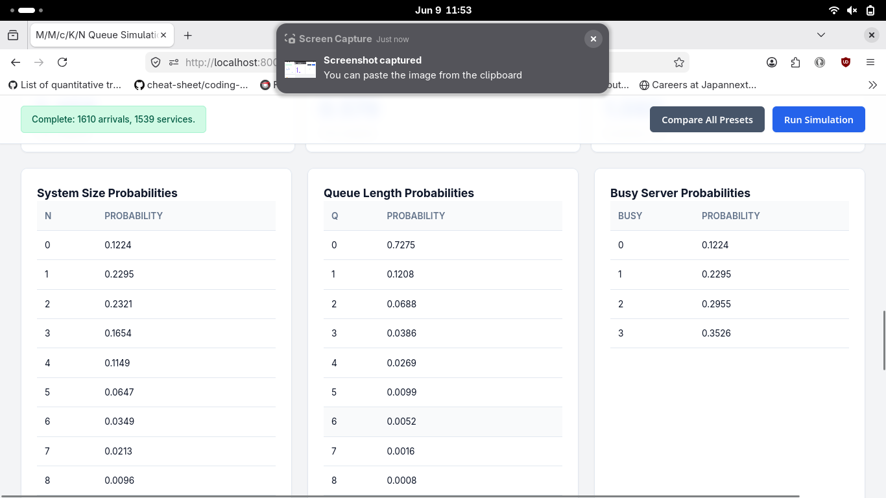

### Цель работы

Цель работы - реализовать дискретно-событийную модель СМО M/M/\* с усложнениями, получить статистику работы системы и сравнить несколько реалистичных сценариев.

В работе используется модель:

```
M/M/c/K/N
```

`c` - число обслуживающих приборов, то есть операторов;
`K` - максимальное число заявок в системе, включая обслуживание и очередь;
`N` - размер источника заявок; если N = 0, источник считается неограниченным;

---









### Вывод

Модель показывает, что для сложной СМО недостаточно учитывать только среднюю загрузку операторов. Даже при нескольких операторах система может работать плохо из-за:

- ограниченной вместимости K;
- ухода нетерпеливых клиентов;
- нехватки общего ресурса;
- слишком высокой интенсивности входящего потока.

Сравнение сценариев позволяет определить, какая причина является основной:

- высокая вероятность отказа означает нехватку вместимости;
- высокая вероятность ухода означает слишком длинную очередь;
- высокая загрузка ресурса при умеренной загрузке операторов означает ресурсное ограничение;
- высокая загрузка операторов означает необходимость увеличить число каналов обслуживания или скорость обслуживания.
